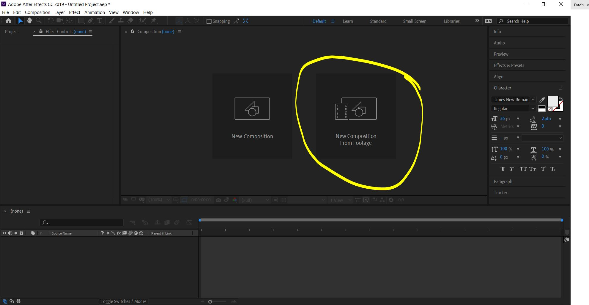
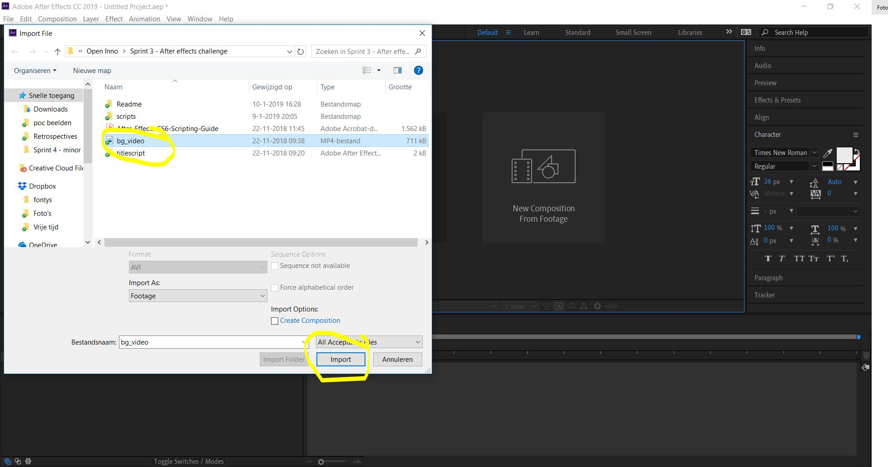
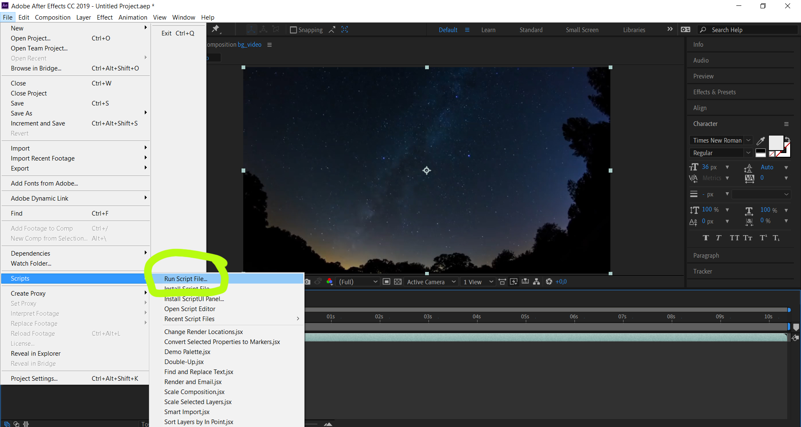
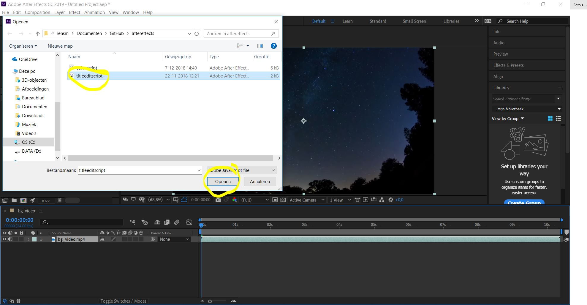
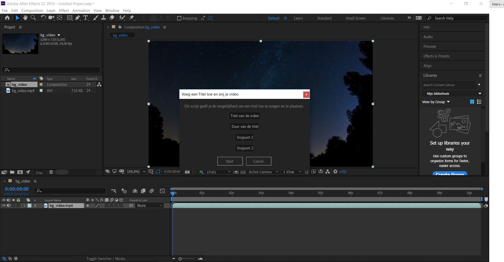
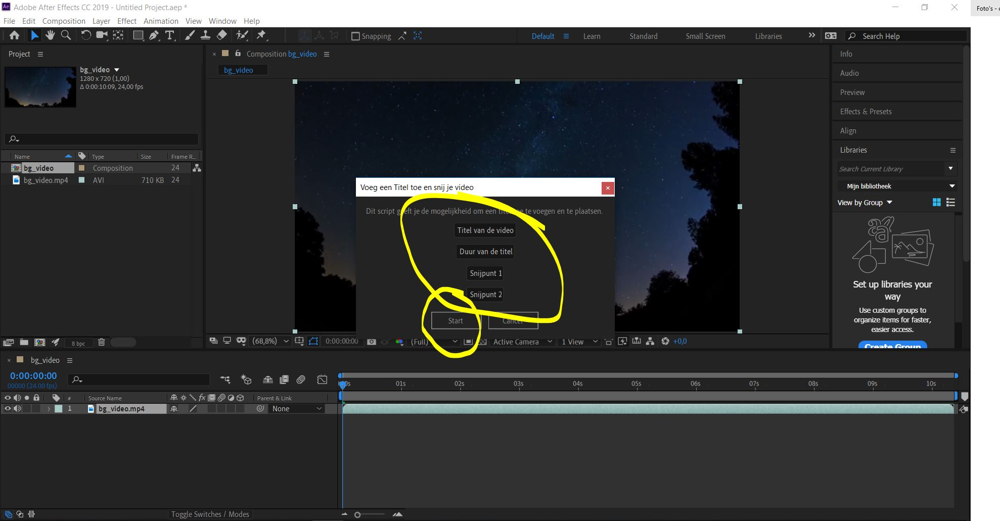
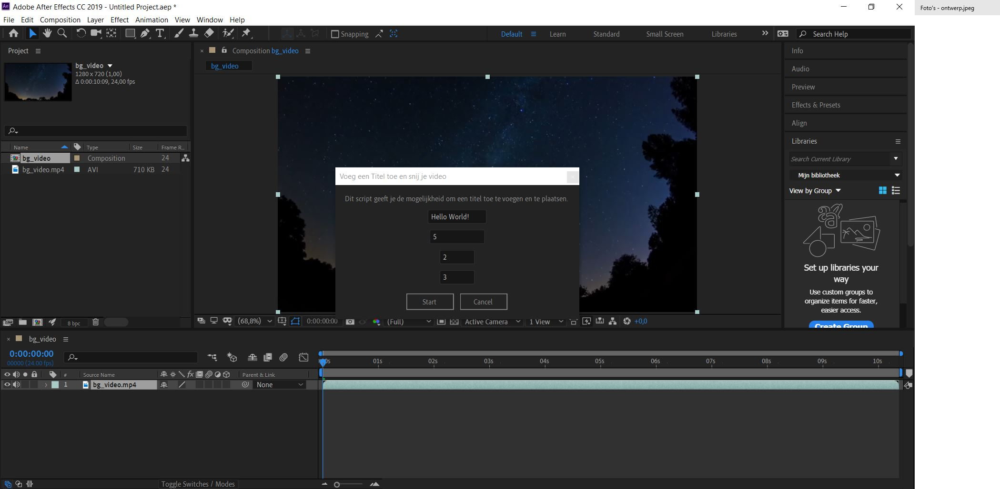
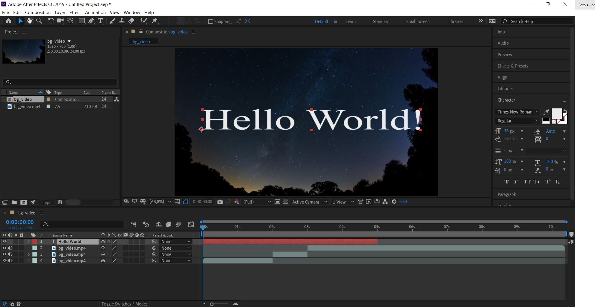

# After Effects challenge
De AE challenge is een challenge die ik zelf bedacht heb voor Adobe After Effects. Als beginner is het vaak lastig om tools te vinden. 
Ik heb er voor gekozen om een tweetal scripts te maken die beginners op weg helpt. 

## Doelgroep
De doelgroep voor deze challenge is niet met een leeftijd te beschrijven, vandaar mijn keuze om de doelgroep te formuleren als: "Beginnende media designers die willen leren werken met het videobewerkingsprogramma After Effects van Adobe."
Ik ben gaan kijken welke basic tools belangrijk zijn voor een beginnende gebruik als deze een video maakt/edit. Dit uitte zich in 2 scripts.

## Prototypes
Twee scripts, namelijk:

Script 1:
Script 2:

## How to use? Stappenplan voor de gebruiker na downloaden:

Stap 1:

Stap 2:

Stap 3:

Stap 4:

Stap 5:

Stap 6:

Voorbeeld:

Voorbeeld:

